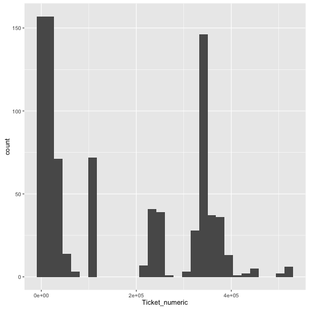

## training_data Data


```
## 'data.frame':	891 obs. of  12 variables:
##  $ PassengerId: int  1 2 3 4 5 6 7 8 9 10 ...
##  $ Survived   : int  0 1 1 1 0 0 0 0 1 1 ...
##  $ Pclass     : int  3 1 3 1 3 3 1 3 3 2 ...
##  $ Name       : Factor w/ 891 levels "Abbing, Mr. Anthony",..: 109 191 358 277 16 559 520 629 417 581 ...
##  $ Sex        : Factor w/ 2 levels "female","male": 2 1 1 1 2 2 2 2 1 1 ...
##  $ Age        : num  22 38 26 35 35 NA 54 2 27 14 ...
##  $ SibSp      : int  1 1 0 1 0 0 0 3 0 1 ...
##  $ Parch      : int  0 0 0 0 0 0 0 1 2 0 ...
##  $ Ticket     : Factor w/ 681 levels "110152","110413",..: 524 597 670 50 473 276 86 396 345 133 ...
##  $ Fare       : num  7.25 71.28 7.92 53.1 8.05 ...
##  $ Cabin      : Factor w/ 148 levels "","A10","A14",..: 1 83 1 57 1 1 131 1 1 1 ...
##  $ Embarked   : Factor w/ 4 levels "","C","Q","S": 4 2 4 4 4 3 4 4 4 2 ...
```


--- .class #id 

## Name/Title
#### The names all have some title associated with them:


```r
training_data$Name[1:9]
```

```
## [1] Braund, Mr. Owen Harris                            
## [2] Cumings, Mrs. John Bradley (Florence Briggs Thayer)
## [3] Heikkinen, Miss. Laina                             
## [4] Futrelle, Mrs. Jacques Heath (Lily May Peel)       
## [5] Allen, Mr. William Henry                           
## [6] Moran, Mr. James                                   
## [7] McCarthy, Mr. Timothy J                            
## [8] Palsson, Master. Gosta Leonard                     
## [9] Johnson, Mrs. Oscar W (Elisabeth Vilhelmina Berg)  
## 891 Levels: Abbing, Mr. Anthony ... Zimmerman, Mr. Leo
```


---

## Name/Title
#### For most passengers we can produce a category related to title:

```r
training_data$title <- NA
attach(training_data)


for(string in c("master","mr","miss","mrs")) {
  training_data$title[grepl(string,Name,ignore.case=T)] <- string 
  }
```
#### And we assume that all with alternate titles are adults and assign them titles based on sex

```r
title[is.na(title)]<-ifelse(Sex[is.na(title)]=="female","mrs","mr")
```


--- 

## Name/Title
#### Which gives us the following result:


```r
training_data[1:9,c("Name","title")]
```

```
##                                                  Name  title
## 1                             Braund, Mr. Owen Harris     mr
## 2 Cumings, Mrs. John Bradley (Florence Briggs Thayer)    mrs
## 3                              Heikkinen, Miss. Laina   miss
## 4        Futrelle, Mrs. Jacques Heath (Lily May Peel)    mrs
## 5                            Allen, Mr. William Henry     mr
## 6                                    Moran, Mr. James     mr
## 7                             McCarthy, Mr. Timothy J     mr
## 8                      Palsson, Master. Gosta Leonard master
## 9   Johnson, Mrs. Oscar W (Elisabeth Vilhelmina Berg)    mrs
```

---

## Name/Title
#### Is there a pattern our models could use to predict survival?


```
##         title
## Survived  mr mrs
##        0 468  81
##        1 109 233
```

<!-- ColumnChart generated in R 3.3.1 by googleVis 0.6.1 package -->
<!-- Sun Sep 11 13:22:27 2016 -->


<!-- jsHeader -->
<script type="text/javascript">
 
// jsData 
function gvisDataColumnChartID11ed276d53eb5 () {
var data = new google.visualization.DataTable();
var datajson =
[
 [
"master",
0.575,
true
],
[
"miss",
0.7,
false
],
[
"mr",
0.1583011583,
true
],
[
"mrs",
0.7906976744,
false
] 
];
data.addColumn('string','title');
data.addColumn('number','prcnt');
data.addColumn({type: 'boolean', role: 'certainty'});
data.addRows(datajson);
return(data);
}
 
// jsDrawChart
function drawChartColumnChartID11ed276d53eb5() {
var data = gvisDataColumnChartID11ed276d53eb5();
var options = {};
options["allowHtml"] = true;
options["title"] = "In-Group Survival Rate by Title";

    var chart = new google.visualization.ColumnChart(
    document.getElementById('ColumnChartID11ed276d53eb5')
    );
    chart.draw(data,options);
    

}
  
 
// jsDisplayChart
(function() {
var pkgs = window.__gvisPackages = window.__gvisPackages || [];
var callbacks = window.__gvisCallbacks = window.__gvisCallbacks || [];
var chartid = "corechart";
  
// Manually see if chartid is in pkgs (not all browsers support Array.indexOf)
var i, newPackage = true;
for (i = 0; newPackage && i < pkgs.length; i++) {
if (pkgs[i] === chartid)
newPackage = false;
}
if (newPackage)
  pkgs.push(chartid);
  
// Add the drawChart function to the global list of callbacks
callbacks.push(drawChartColumnChartID11ed276d53eb5);
})();
function displayChartColumnChartID11ed276d53eb5() {
  var pkgs = window.__gvisPackages = window.__gvisPackages || [];
  var callbacks = window.__gvisCallbacks = window.__gvisCallbacks || [];
  window.clearTimeout(window.__gvisLoad);
  // The timeout is set to 100 because otherwise the container div we are
  // targeting might not be part of the document yet
  window.__gvisLoad = setTimeout(function() {
  var pkgCount = pkgs.length;
  google.load("visualization", "1", { packages:pkgs, callback: function() {
  if (pkgCount != pkgs.length) {
  // Race condition where another setTimeout call snuck in after us; if
  // that call added a package, we must not shift its callback
  return;
}
while (callbacks.length > 0)
callbacks.shift()();
} });
}, 100);
}
 
// jsFooter
</script>
 
<!-- jsChart -->  
<script type="text/javascript" src="https://www.google.com/jsapi?callback=displayChartColumnChartID11ed276d53eb5"></script>
 
<!-- divChart -->
  
<div id="ColumnChartID11ed276d53eb5" 
  style="width: 500; height: automatic;">
</div>
###### Clearly, adult men are fare less likely than either adult women or children of either gender to have survived the Titanic.

---

## Ticket
#### We have a similar text issue with ticket number ...


```r
training_data$Ticket[1:40]
```

```
##  [1] A/5 21171        PC 17599         STON/O2. 3101282 113803          
##  [5] 373450           330877           17463            349909          
##  [9] 347742           237736           PP 9549          113783          
## [13] A/5. 2151        347082           350406           248706          
## [17] 382652           244373           345763           2649            
## [21] 239865           248698           330923           113788          
## [25] 349909           347077           2631             19950           
## [29] 330959           349216           PC 17601         PC 17569        
## [33] 335677           C.A. 24579       PC 17604         113789          
## [37] 2677             A./5. 2152       345764           2651            
## 681 Levels: 110152 110413 110465 110564 110813 111240 111320 ... WE/P 5735
```

---

## Ticket Number
#### ... which we can solve with the gsub function:

```r
attach(training_data)
training_data$Ticket_numeric <- as.numeric(gsub("[^0-9]","",Ticket))
```


```r
training_data[1:9,c("Ticket","Ticket_numeric")]
```

```
##             Ticket Ticket_numeric
## 1        A/5 21171         521171
## 2         PC 17599          17599
## 3 STON/O2. 3101282       23101282
## 4           113803         113803
## 5           373450         373450
## 6           330877         330877
## 7            17463          17463
## 8           349909         349909
## 9           347742         347742
```


---
## Ticket Number
#### To find patterns in the assignment of ticket numbers, we plot a histogram


---
